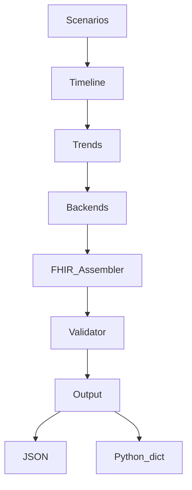

# fhir-synth — Deterministic FHIR R4 Synthetic Data Generator

⚠️ **Clinical Safety Disclaimer:** This software generates **synthetic data only**. It is not derived from real patients, electronic health records, or clinical datasets. It is **not for clinical use**, research validation, or regulatory submission without independent verification.

## What This Is

A library for generating reproducible, scenario-driven FHIR R4 resources for testing, simulation, and research. Uses deterministic random number generators, trend arithmetic, and Gaussian noise — same seed → identical output.

## What This Is Not

- Not a real EHR or patient data source
- Not a substitute for clinical datasets
- Not a FHIR server (outputs Python dicts/lists or JSON strings)
- Not GPU-dependent (runs on any CPU)
- No neural generation in default backends

## Architecture



## Quick Start

### Install

```bash
pip install fhir-synth
```

### CLI

```bash
python -m fhir_synth --scenario icu_sepsis --duration 240 --seed 42 --output pretty
```

List available scenarios:

```bash
python -m fhir_synth --list-scenarios
```

### Python API

```python
from fhir_synth import build_timeline, assemble_fhir_bundle, SynthConfig

config = SynthConfig(duration_minutes=240, backends=["observation", "patient", "encounter"])
timeline = build_timeline("icu_sepsis", config, seed=42)
bundle = assemble_fhir_bundle(timeline, config)

# Inspect observations
observations = [r for r in bundle["entry"] if r["resource"]["resourceType"] == "Observation"]
print(f"Generated {len(observations)} observations")
```

## Scenarios

| Scenario | Duration | Description | Trajectory |
|----------|----------|-------------|------------|
| `normal` | Any | Healthy baseline | Flat vitals with Gaussian noise |
| `icu_sepsis` | 240 min | Sepsis onset → deterioration | Phase 0-60: subtle, 60-120: acceleration, 120-240: decompensation |
| `post_op_recovery` | 240 min | Post-surgical recovery | Phase 0-30: stress, 30-120: exponential normalization, 120-240: stable |
| `ards` | 240 min | ARDS with refractory hypoxemia | Phase 0-30: normal, 30-60: rapid SpO2 drop, 60-240: refractory |
| `cardiac_arrest` | 240 min | Sudden cardiac arrest | Phase 0-120: normal, 120-122: VTach spike, 122+: flatline/CPR |

## Backends

### Built-in

- **ObservationBackend** — LOINC-coded vital signs (HR, BP, SpO2, RR, Temp)
- **PatientBackend** — Demographics with deterministic identifiers
- **EncounterBackend** — Admission, discharge with diagnoses

### Custom Backends

Implement the `ResourceBackend` protocol:

```python
from fhir_synth.backends.base import ResourceBackend
from fhir_synth.models import ClinicalTimeline, SynthConfig

class AllergyIntoleranceBackend:
    @property
    def resource_type(self) -> str:
        return "AllergyIntolerance"

    def generate(self, timeline: ClinicalTimeline, config: SynthConfig) -> list[dict]:
        # Map timeline events to FHIR AllergyIntolerance resources
        return [...]
```

Register it in `_BACKEND_MAP` in `fhir_assembler.py` or pass it directly.

## Integration Example

```python
from fhir_synth import build_timeline, assemble_fhir_bundle, SynthConfig

# Generate synthetic ICU patient
config = SynthConfig(duration_minutes=240, backends=["observation", "patient"])
timeline = build_timeline("icu_sepsis", config, seed=42)
bundle = assemble_fhir_bundle(timeline, config)

# Pass to another tool for processing
observations = [r for r in bundle["entry"] if r["resource"]["resourceType"] == "Observation"]
```

## Configuration

### SynthConfig

| Field | Type | Default | Description |
|-------|------|---------|-------------|
| `duration_minutes` | int | 240 | Length of simulation |
| `sample_interval_minutes` | int | 1 | Time between samples |
| `backends` | list[str] | ["observation", "patient", "encounter"] | Active backends |

### Environment

| Variable | Description |
|----------|-------------|
| `PYTHONHASHSEED` | Set to `0` for fully deterministic dict ordering |

## Testing

```bash
pip install -e ".[dev]"
pytest -v --cov=src
```

## License

MIT
